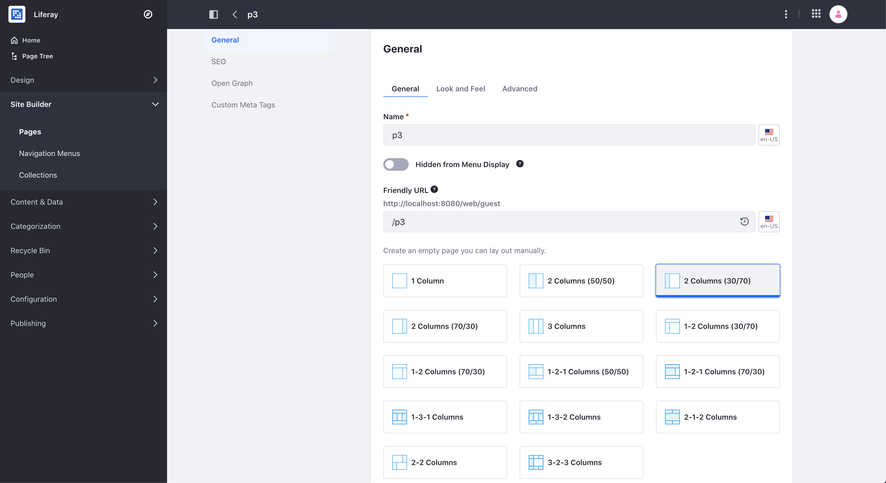
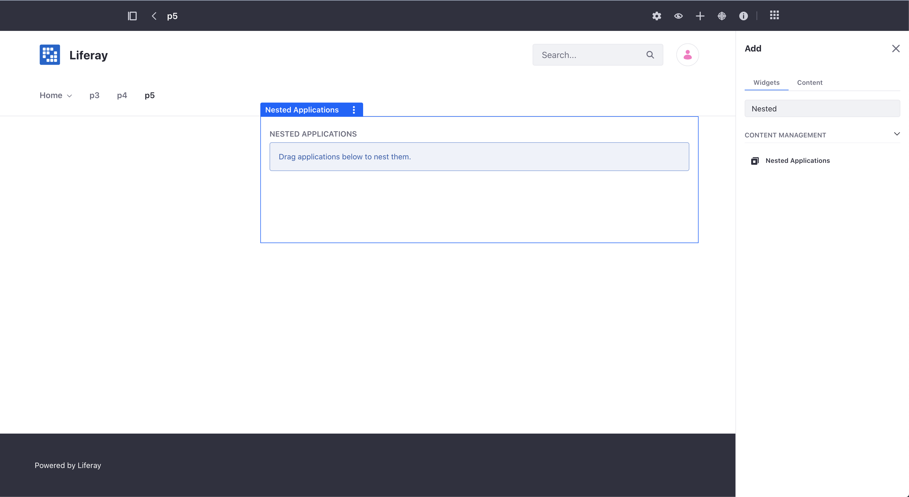
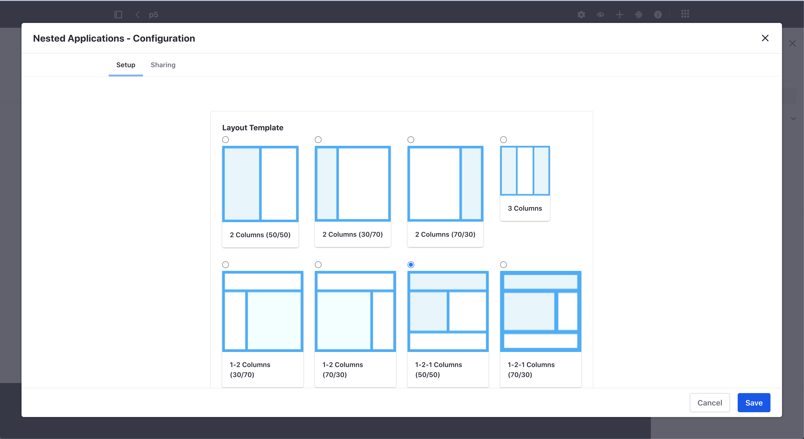
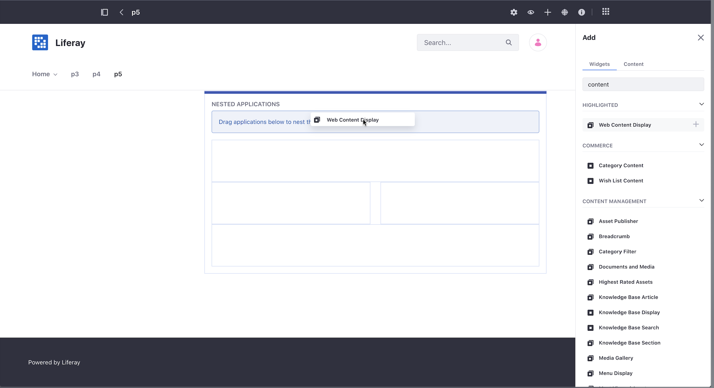
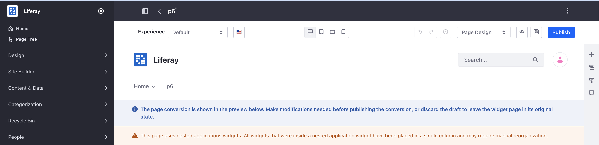

title: Nested Applications Widget
author:
  name: Rubén Pulido
style: basic-style.css
output: index.html
controls: false

--
# Nested Applications Widget

--
### Purpose
Sometimes a particular layout is almost what you want but not quite. 

In this case use the Nested Portlets portlet **to embed a layout inside another layout**. 

This portlet is a **container for other portlets**. 

It lets you select from **any of the layouts installed in Liferay**, just like the layouts for a page. 

This gives you virtually unlimited options for laying out your pages.

--
### Widget Page Layout

--
### Add Nested Applications Widget

--
### Nested Applications Widget Configuration

--
### Add Nested Widget

--
### Limitations

- Only supported on Widget Pages
- Best Effort Conversion when a Widget Page is converted to a Content Page.

--
### Convert Widget Page

--
### Documentation (I)
**Modifying Widget Page Layouts**
https://help.liferay.com/hc/en-us/articles/360018152571-Creating-Sites-and-Managing-Pages#modifying-page-layouts

**Content Page Limitations for Widgets**
https://learn.liferay.com/dxp/latest/en/site-building/creating-pages/using-content-pages/using-widgets-on-a-content-page.html?highlight=nested#content-page-limitations-for-widgets
--
### Documentation (II)
**Best Effort Convertions converting Widget Pages to Content Pages**

https://learn.liferay.com/dxp/latest/en/site-building/creating-pages/using-widget-pages/configuring-widgets/converting-widget-pages-to-content-pages.html#best-effort-conversions

--
### Thank you!

--
